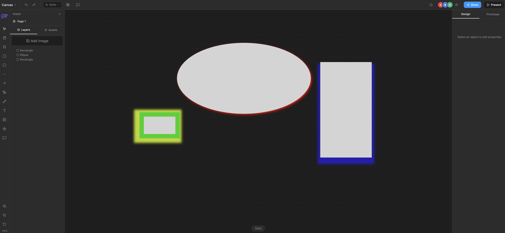

# 🎨 JR Canvas | Figma-Style Design Editor

<p align="center">
  
</p>

<p align="center">
  
  
  
  
  
</p>

<p align="center">
  
</p>

JR Canvas is a **Figma-style design editor built with React + Vite + TypeScript** featuring an infinite canvas, drawing tools, layers, assets, prototype connections, and full responsive interaction support for desktop, tablet, and mobile devices.

This project focuses on building a **real canvas engine**, not just UI — including pointer-based interactions, transform logic, state management, and dynamic rendering inside the canvas.

---

## 🚀 Live Demo

https://your-demo-link-here

---

## 📌 Problem

Most browser-based design demos are limited to simple drawing and only work on desktop.  
They often lack:

- Infinite canvas support  
- Proper layer management  
- Responsive touch interaction  
- Prototype navigation  
- In-canvas media rendering  

Professional tools like Figma solve this, but building one from scratch requires solving complex interaction and state problems.

---

## ✅ Solution

JR Canvas implements a full design editor with:

- Infinite canvas with zoom & pan
- Multiple drawing tools
- Layers, assets, and pages
- Prototype connections
- Dark / light mode
- Mobile + tablet + desktop support
- Pointer-based interaction system
- Drag / resize / rotate transforms
- In-canvas media rendering

---

## 🔥 Key Features

- Infinite canvas with zoom & pan
- Shape, pen, pencil, and text tools
- Layers panel with nesting
- Multi-page support
- Design properties panel
- Prototype connections
- Comment pins
- Context menu actions
- Keyboard shortcuts
- Undo / redo history
- Dark / light mode
- Fully responsive (mobile / tablet / desktop)

---

## 🧩 Detailed Features

✅ Infinite Canvas — Zoom (Ctrl+Scroll), pan, dot-grid background  
✅ Shape Tools — Rectangle, ellipse, frame, line, arrow  
✅ Pen & Pencil — Freehand + point-by-point drawing  
✅ Text Tool — Editable text with typography controls  
✅ Selection & Transform — Multi-select, resize, drag, rotate  
✅ Layers Panel — Visibility, lock, rename, nesting  
✅ Assets Panel — Component library support  
✅ Pages — Add / delete / rename pages  
✅ Design Properties — Fill, stroke, opacity, radius, typography, shadow  
✅ Prototype Panel — Navigation between pages  
✅ Comment Tool — Canvas annotations  
✅ Context Menu — Duplicate, delete, group, order  
✅ Keyboard Shortcuts — Tool switching & editing  
✅ Undo / Redo — 50-step history  

---

## ⌨️ Keyboard Shortcuts

| Key | Action |
|-----|--------|
| V | Select |
| H | Hand |
| F | Frame |
| R | Rectangle |
| O | Ellipse |
| L | Line |
| P | Pen |
| T | Text |
| Delete | Delete |
| Ctrl+Z | Undo |
| Ctrl+Shift+Z | Redo |
| Ctrl+D | Duplicate |
| Ctrl+G | Group |
| Ctrl+Shift+G | Ungroup |
| [ / ] | Layer order |
| Arrow keys | Nudge |
| Shift+drag | Constrain |
| Space+drag | Pan |
| Ctrl+Scroll | Zoom |

---

## 🧠 Technical Challenges Solved

- Converting mouse events → pointer events for mobile support
- Implementing infinite canvas transforms
- Maintaining correct object positions while zooming
- Managing global state with Zustand
- Rendering text editor overlay
- Handling drag / resize / rotate logic
- Rendering media directly inside canvas
- Preventing layout break on small screens
- Keeping performance smooth with many objects

---

## 🧑‍💻 Tech Stack

| Library | Purpose |
|---------|----------|
| React 19 | UI |
| TypeScript | Type safety |
| Vite 7 | Build |
| Tailwind CSS v4 | Styling |
| Zustand v5 | State |
| react-colorful | Color picker |
| lucide-react | Icons |
| perfect-freehand | Drawing smoothing |
| Radix UI | UI primitives |

---

## 🎯 Learning Outcomes

- Built a full canvas engine in React
- Implemented pointer-based input system
- Designed transform & selection logic
- Created layered state architecture
- Built responsive interaction system
- Implemented prototype navigation
- Built advanced UI panels
- Structured large React project

---

## 🔮 Future Improvements

- Real file save / load
- Export as image / PDF
- Multi-select transform box
- Snap to grid
- Real-time collaboration
- Performance optimization
- Backend storage

---

## 🛠 Installation

```bash
git clone https://github.com/jeanrichardson610/jr-canvas.git
cd jr-canvas
npm install
npm run dev